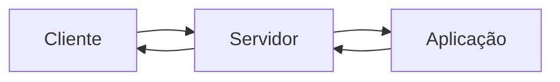

# Introdução ao desenvolvimento WEB

## A Web

Aplicação web é uma aplicação que funciona em **rede**. A ideia principal é a conexão entre os dispositivos.

São redes:

1. Dois ou mais dispositivos interconectados
2. Local (LAN - *local area network*)
3. Longa distância - WAN - *wide area network*
4. Mundial, como a própria internet

## Modelo Cliente-Servidor

É o **modelo de comunicação**. No contexto de aplciações web, esse é o modelo mais comum.

O modelo cliente-servidor acontece através de um servidor que serve uma aplicação e o cliente a consome.

### Servidor de Aplicação: Uvicorn

O FastAPI é um framework web, mas não um servidor de aplicação. Para isso, é utilizado o servidor Uvicorn.

Servidor do tipo ASGI.

#### Servindo: internamente x rede local

Há uma diferença entre rodar a aplicação internamente e na rede local.

Ao servir a aplicação sem customizar o host/IP, a aplicação é servida no IP interno 127.0.0.1. Esse IP é o endereço de *loopback*, acessível apenas internamente, mas não por outros dispositivos da rede local. Esse modelo é chamado de *loopback* porque a requisição é realizada para a própria máquina, que é onde a aplicação foi executada.

Para servir a aplicação em rede local, devemos apontar a aplicação para o host do endereço 0.0.0.0.

## Tríade da Web

O modelo padrão da web é composto por 3 padrões.

### URL

URL = Localizador Uniforme de Recursos.  
É um endereço de rede pelo qual podemos nos comunicar com um computador na rede.

Padrão: `protocolo://endereço:porta/caminho/recurso?query#fragmento`

- Protocolo: Define o método de comunicação
- Endereço: Define o IP do dispositivo a ser conectado
  - Localhost ou 127.0.0.1 = Loopback, não exposto
  - 0.0.0.0: endereço da máquina exposto na rede local
- Porta: define o "local" de conexão no dispoisitivo a ser conectado
  - É opcional
  - Quando omitido seu valor, temos o default: 80 para HTTP e 443 para HTTPS
- Caminho: indica a localização exata do recurso no servidor
  - Quando omitido, seu padrão é o recurso que está na raiz `/`
- Recurso: identifica o recurso dentro do caminho definido

### HTTP/HTTPS

É o protocolo que realiza a comunicação entre cliente e servidor quando surge uma requisição. Dessa forma, as requisições e respostas são **formatadas** de acordo com as regras do padrão.

Todo o fluxo da comunicação entre servidor e cliente, ou seja, as requisições e respostas, é tratado por **mensagens**.

Nessas mensagens, temos alguns elementos como: 

1. Cabeçalho, que contem metadados essenciais sobre as requisições/respostas, como por exemplo o tipo de mídia da mensagem, o verbo relacionado, etc.
2. Corpo: o próprio conteúdo da mensagem

No contexto do curso: o FastAPI tem com default o formato de json para respostas, de forma que outros formatos de respostas devem ser especificados.

#### Verbos

Sinaliza a **intenção** da requisição.

- GET
- POST
- PUT
- DELETE

#### Códigos de Resposta

Alguns descritivos por meio de imagens: [HTTP Status Dogs](https://httpstatusdogs.com/).

São indicativos do que ocorreu com a requisição que são fornecidos junto com a mensagem da resposta. Esses códigos são divididos em classes e as classes distribuem-se por centenas

Exemplos de classes de respostas

- 1xx: informativo
- 2xx: sucesso
- 3xx: redirecionamento
- 4xx: erro no cliente
- 5xx: erro no servidor

Códigos importantes para o curso

- 200 OK
- 201 Created
- 404 Not Found
- 422 Unprocessable Entity - requisição OK porém com dados não validados

Esses códigos, no contexto do curso, podem ser definidos no próprio código que define os recursos e afins.

No código, podemos usar a biblioteca http e usar a classe HTTPStatus para definr os códigos das respostas sem necessariamente definir as strings ou números de todas as respostas, tornando-se de mais fácil compreensão.

### HTML

*Hypertext Markup Language*

É a linguagem padrão para criação e definição de páginas web.

## APIs :star:

- Rever diferença de API REST e JSON
- Referência no curso: [Trafegando JSON](https://fastapidozero.dunossauro.com/02/#trafegando-json)

APIs REST: utilizam HTML como engine. Não é o caso aqui.

APIs JSON: não utilizam de HTML e trafegam JSON como formato de mensagens. São dados brutos, por isso não são APIs REST. Aqui serão utilizadas APIs desse sentido.

### Endpoints

São endereços que representam os pontos de entrada das APIs, onde cada endpoint está associado a uma função da API, como obter dados, etc.

A definição dos endpoints inclui o caminho na URL e os métodos HTTP permitidos (verbos). Dessa forma, para realizar requisições adequadas é necessário que a URL da requisição seja formatada de acordo com essa definição da API.

Por exemplo, considerando uma API que tem um endpoint que disponibiliza os preços de produtos, para obter o preço de um determinado produto, devemos fazer uma requisição para o endpoint desse recurso + id do produto: `https://api.service.com/price/{id}`. Além disso, o método HTTP utilizado deve estar de acordo com o que foi definido na API, provavelmente um GET ou POST.

### Contratos

O schema define a forma e o conteúdo dos dados que são trafegados entre servidor e cliente, servindo como um contrato que garante que esses agentes estejam alinhados nesse sentido.

Especificações dos contratos:

- Campos de Dados Esperados
- Restrições Adicionais
- Estrutura de Objetos Aninhados

#### Pydantic

Para definição dos schemas e validação de tipos no FastAPI utilizamos o Pydantic. Esses schemas podem ser definidos por meio de classes Python.

## Exercício

> Crie um endpoint que retorna "olá mundo" usando HTML e escreva seu teste. Dica: para capturar a resposta do HTML do cliente de testes, você pode usar response.text.

### Resolução

1. Foi implementado o novo endpoint em `/fast_zero/fast_zero/app.py`
2. Foi implementado o teste de status code e conteúdo da mensagem com padrão AAA em `/fast_zero/tests/test_app.py`
