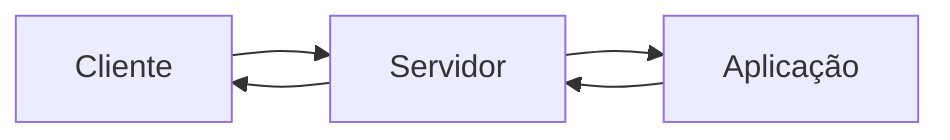

# Introdução ao desenvolvimento WEB

## A Web

Aplicação web é uma aplicação que funciona em **rede**. A ideia principal é a conexão entre os dispositivos.

São redes:

1. Dois ou mais dispositivos interconectados
2. Local (LAN - *local area network*)
3. Longa distância - WAN - *wide area network*
4. Mundial, como a própria internet

## Modelo Cliente-Servidor

É o **modelo de comunicação**. No contexto de aplciações web, esse é o modelo mais comum.

O modelo cliente-servidor acontece através de um servidor que serve uma aplicação e o cliente a consome.

### Servidor de Aplicação: Uvicorn

O FastAPI é um framework web, mas não um servidor de aplicação. Para isso, é utilizado o servidor Uvicorn.

Servidor do tipo ASGI.

#### Servindo: internamente x rede local

Há uma diferença entre rodar a aplicação internamente e na rede local.

Ao servir a aplicação sem customizar o host/IP, a aplicação é servida no IP interno 127.0.0.1. Esse IP é o endereço de *loopback*, acessível apenas internamente, mas não por outros dispositivos da rede local. Esse modelo é chamado de *loopback* porque a requisição é realizada para a própria máquina, que é onde a aplicação foi executada.

Para servir a aplicação em rede local, devemos apontar a aplicação para o host do endereço 0.0.0.0.

## Tríade da Web

O modelo padrão da web é composto por 3 padrões.

### URL

URL = Localizador Uniforme de Recursos.  
É um endereço de rede pelo qual podemos nos comunicar com um computador na rede.

Padrão: `protocolo://endereço:porta/caminho/recurso?query#fragmento`

- Protocolo: Define o método de comunicação
- Endereço: Define o IP do dispositivo a ser conectado
  - Localhost ou 127.0.0.1 = Loopback, não exposto
  - 0.0.0.0: endereço da máquina exposto na rede local
- Porta: define o "local" de conexão no dispoisitivo a ser conectado
  - É opcional
  - Quando omitido seu valor, temos o default: 80 para HTTP e 443 para HTTPS
- Caminho: indica a localização exata do recurso no servidor
  - Quando omitido, seu padrão é o recurso que está na raiz `/`
- Recurso: identifica o recurso dentro do caminho definido

### HTTP

